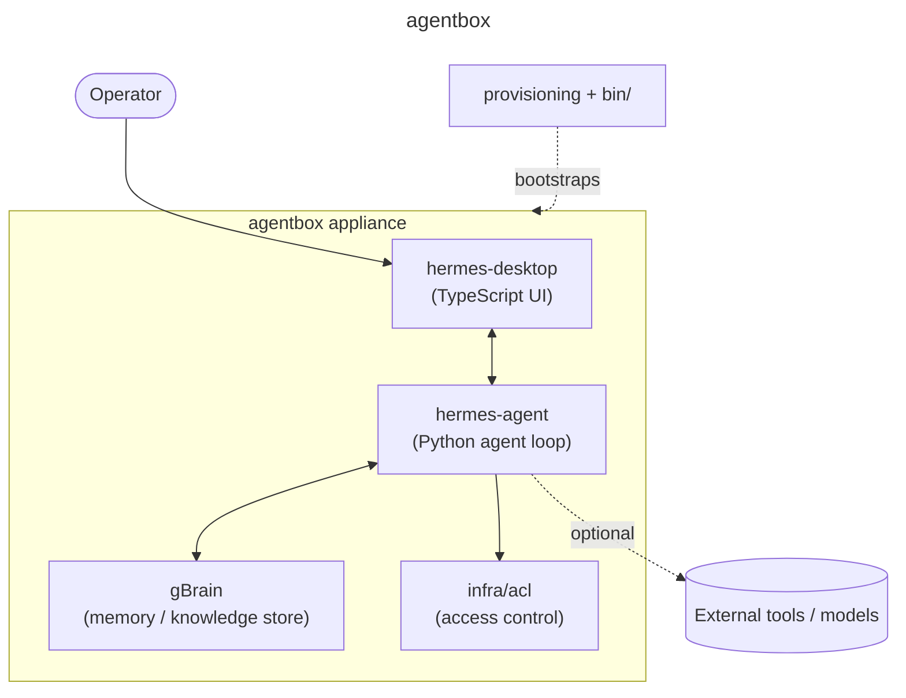

<!-- Banner/Logo -->
<p align="center">
  <picture>
    <source media="(prefers-color-scheme: dark)" srcset="assets/banner-dark_v1.0.0.svg">
    <source media="(prefers-color-scheme: light)" srcset="assets/banner-light_v1.0.0.svg">
    
  </picture>
</p>

<!-- Badges -->
<p align="center">
  
  <a href="https://github.com/UMB-Advisors/AgentBOX/releases"></a>
  <a href="https://github.com/UMB-Advisors/AgentBOX/actions"></a>
  
</p>

<p align="center">
  
  
  
  
</p>

<!-- One-Liner -->
<p align="center"><strong>An edge-AI appliance that runs a local agent, its long-term memory, and a desktop control surface as one self-provisioning box.</strong></p>

---

<details>
<summary>Table of Contents</summary>

- [About](#about)
- [Architecture](#architecture)
- [Components](#components)
- [Getting Started](#getting-started)
- [Provisioning the Appliance](#provisioning-the-appliance)
- [Reflashing the OS (JetPack)](#reflashing-the-os-jetpack)
- [Repository Layout](#repository-layout)
- [The thUMBox Family](#the-thumbox-family)
- [Contributing](#contributing)
- [License](#license)

</details>

## About

**agentbox** packages a self-hosted AI agent, its persistent memory, and a native desktop front end into a single edge appliance you can provision and hand off. Instead of routing every request to a cloud endpoint, agentbox keeps the agent loop, knowledge store, and access control on the box — useful where data residency, latency, offline operation, or running your own models matter.

It is built as a monorepo of four cooperating parts — the **Hermes agent**, the **gBrain** memory layer, the **desktop** client, and the vendored **MailBOX** email stack — plus the infrastructure scripts that turn a bare machine into a working appliance.

> [!IMPORTANT]
> **AgentBOX is the source of truth for the unified appliance** = the **MailBOX** email pipeline (triage → draft → approve → send) **plus** the Hermes agent + gBrain, co-resident on one Jetson. As of UMB-105 the MailBOX app stack is **vendored in this monorepo** under [`mailbox/`](./mailbox) (no external clone); `install/agentbox-install.sh` syncs it into place. This repo owns everything: the vendored stack, the installer, the Hermes/gBrain wiring (`config/hermes/`), the compose override (`config/`), the boot units (`systemd/`), and the JetPack flow.
>
> **New box:** flashed Jetson → `install/agentbox-install.sh --prototype`; bare hardware → the **`/agentbox-flash`** skill. See [`docs/agentbox-jp72-reproduction.v0.1.0.md`](./docs/agentbox-jp72-reproduction.v0.1.0.md).

## Architecture



## Components

| Component | Path | Stack | Role |
|-----------|------|-------|------|
| **Hermes agent** | upstream, installed on-box | Python | Upstream NousResearch hermes-agent **v0.16.0** at `~/.hermes/hermes-agent-v2`; patch branch `agentbox2-v3` in [`UMB-Advisors/agentbox-hermes-patches`](https://github.com/UMB-Advisors/agentbox-hermes-patches). Served at `/hermes/` behind the sidecar. |
| **Custom UI + features** | [`UMB-Advisors/agentbox-sidecar`](https://github.com/UMB-Advisors/agentbox-sidecar) | Python / TypeScript | ALL custom AgentBOX features + the operator dashboard (FastAPI `:9200`, serves the dashboard at `/`, stock hermes at `/hermes/`). |
| **hermes-agent-main/** | [`hermes-agent-main/`](./hermes-agent-main) | Python | **Stale duplicate / archive** — frozen vendored fork, history/rollback only (see [`hermes-agent-main/DEPRECATED.md`](./hermes-agent-main/DEPRECATED.md)). |
| **gBrain** | [`gbrain-master/`](./gbrain-master) | Python | Persistent memory and knowledge store the agent reads from and writes to. |
| **Desktop** | [`hermes-desktop-main/`](./hermes-desktop-main) | TypeScript | Native control surface for interacting with and supervising the agent. |
| **ACL** | [`infra/acl/`](./infra/acl) | Config | Access control for agent capabilities and resources. |
| **Provisioning** | [`provisioning/`](./provisioning) | Shell | Scripts that turn a bare machine into a configured appliance. |
| **Unified installer** | [`install/`](./install) + [`config/`](./config) + [`systemd/`](./systemd) | Shell | One-command bring-up of the unified MailBOX + Hermes appliance; clones the MailBOX stack and wires Hermes/gBrain/boot. |
| **MailBOX stack** | [`mailbox/`](./mailbox) | Compose | Email pipeline (postgres, qdrant, ollama, n8n, dashboard). **Vendored in this monorepo** (UMB-105); `install/agentbox-install.sh` syncs it into place. |
| **CLI** | [`bin/`](./bin) | Shell | Entry-point commands for operating the box. |
| **Skill** | [`.skill/`](./.skill) | — | Packaged skill definition for agent tooling. |
| **Docs** | [`docs/`](./docs) | TeX / Markdown | Design notes and appliance documentation. |

## Getting Started

> [!IMPORTANT]
> agentbox targets a Linux host (developed on Ubuntu 24.04). You will need Python 3.11+, Node.js 20+, and a POSIX shell. Component subprojects carry their own dependency manifests.

```bash
git clone https://github.com/UMB-Advisors/AgentBOX.git
cd AgentBOX
```

The real bring-up flow:

1. **Flash** the Jetson (bare hardware → the `/agentbox-flash` skill; reflash runbook below).
2. **Install** on the box: `install/agentbox-install.sh --prototype` — ⚠️ STAGES 7/7.5/7.6
   currently provision the **pre-sidecar** architecture; the installer rework is tracked
   under MBOX-428. See the warning header in the script.
3. **Sidecar setup**: install [`UMB-Advisors/agentbox-sidecar`](https://github.com/UMB-Advisors/agentbox-sidecar)
   (`agentbox-sidecar.service`, `:9200`) per its `docs/update-runbook.md` — this is the
   user-facing UI and the home of all custom features.

## Provisioning the Appliance

To stand up agentbox on fresh hardware rather than running the components by hand, run
`install/agentbox-install.sh` from the repo root on the target machine (staged, idempotent;
see step 2 above for the pre-sidecar caveat).

> [!TIP]
> Provisioning wires up the agent, gBrain, the ACL layer, and the boot units into a single managed appliance. Review `infra/acl/` before exposing the box on a shared network.

## Reflashing the OS (JetPack)

Provisioning assumes a flashed JetPack base. To re‑image a box from scratch — e.g. moving the Orin Nano Super from JetPack 6.2 to **JetPack 7.2** (Jetson Linux r39.2, Ubuntu 24.04, CUDA 13), headless — follow the dedicated runbook:

➡️ **[`docs/reflash-jetpack-7.2.v0.1.0.md`](./docs/reflash-jetpack-7.2.v0.1.0.md)** — backup → Force Recovery → `sdkmanager --cli` flash → headless (no desktop) → restore.

> [!WARNING]
> A reflash wipes the NVMe (root, Docker volumes, Tailscale state, users). Back up off‑box first, and note that the JetPack 6.2→7.2 jump (CUDA 12.6→13) requires rebuilding the GPU containers and updating the `provisioning/` pins. See the runbook's caveats.

## Repository Layout

```text
agentbox/
├── bin/                  # CLI entry points
├── docs/                 # design notes & documentation
├── gbrain-master/        # gBrain — persistent memory / knowledge store
├── hermes-agent-main/    # Hermes agent — core agent loop
├── hermes-desktop-main/  # desktop control surface
├── infra/acl/            # access control
├── provisioning/         # appliance bootstrap scripts
└── .skill/               # packaged skill definition
```

## The thUMBox Family

agentbox is part of the **thUMBox** appliance family from [UMB Advisors](https://umbadvisors.com) — a line of edge-AI boxes that put agents, memory, and control on hardware you own.

## Contributing

Issues and pull requests are welcome. Please:

1. Open an issue describing the change before large PRs.
2. Keep component changes scoped to their subproject (`hermes-agent`, `gbrain`, `hermes-desktop`).
3. Run each component's checks before submitting.

## License

Proprietary — internal UMB Advisors appliance monorepo; no open-source license granted. (A `LICENSE` file is intentionally absent.)

---

<p align="center"><sub>Built by <a href="https://umbadvisors.com">UMB Advisors</a> · part of the thUMBox appliance family</sub></p>
