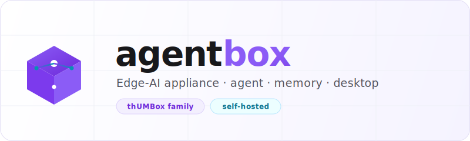

<!-- Banner/Logo -->
<p align="center">
  <picture>
    <source media="(prefers-color-scheme: dark)" srcset="assets/banner-dark_v1.0.0.svg">
    <source media="(prefers-color-scheme: light)" srcset="assets/banner-light_v1.0.0.svg">
    
  </picture>
</p>

<!-- Badges -->
<p align="center">
  <a href="LICENSE"></a>
  <a href="https://github.com/UMB-Advisors/agentbox/releases"></a>
  <a href="https://github.com/UMB-Advisors/agentbox/actions"></a>
  
</p>

<p align="center">
  
  
  
  
</p>

<!-- One-Liner -->
<p align="center"><strong>An edge-AI appliance that runs a local agent, its long-term memory, and a desktop control surface as one self-provisioning box.</strong></p>

> [!NOTE]
> This project was formerly named **HermesBOX**. The repository is being renamed to **agentbox**. Update remotes with `git remote set-url origin https://github.com/UMB-Advisors/agentbox.git`. The internal `hermes-agent` component retains its name.

---

<details>
<summary>Table of Contents</summary>

- [About](#about)
- [Architecture](#architecture)
- [Components](#components)
- [Getting Started](#getting-started)
- [Provisioning the Appliance](#provisioning-the-appliance)
- [Repository Layout](#repository-layout)
- [The thUMBox Family](#the-thumbox-family)
- [Contributing](#contributing)
- [License](#license)

</details>

## About

**agentbox** packages a self-hosted AI agent, its persistent memory, and a native desktop front end into a single edge appliance you can provision and hand off. Instead of routing every request to a cloud endpoint, agentbox keeps the agent loop, knowledge store, and access control on the box — useful where data residency, latency, offline operation, or running your own models matter.

It is built as a monorepo of three cooperating runtimes — the **Hermes agent**, the **gBrain** memory layer, and the **desktop** client — plus the infrastructure scripts that turn a bare machine into a working appliance.

## Architecture


## Components

| Component | Path | Stack | Role |
|-----------|------|-------|------|
| **Hermes agent** | [`hermes-agent-main/`](./hermes-agent-main) | Python | The core agent loop — planning, tool use, and orchestration on the box. |
| **gBrain** | [`gbrain-master/`](./gbrain-master) | Python | Persistent memory and knowledge store the agent reads from and writes to. |
| **Desktop** | [`hermes-desktop-main/`](./hermes-desktop-main) | TypeScript | Native control surface for interacting with and supervising the agent. |
| **ACL** | [`infra/acl/`](./infra/acl) | Config | Access control for agent capabilities and resources. |
| **Provisioning** | [`provisioning/`](./provisioning) | Shell | Scripts that turn a bare machine into a configured appliance. |
| **CLI** | [`bin/`](./bin) | Shell | Entry-point commands for operating the box. |
| **Skill** | [`.skill/`](./.skill) | — | Packaged skill definition for agent tooling. |
| **Docs** | [`docs/`](./docs) | TeX / Markdown | Design notes and appliance documentation. |

## Getting Started

> [!IMPORTANT]
> agentbox targets a Linux host (developed on Ubuntu 24.04). You will need Python 3.11+, Node.js 20+, and a POSIX shell. Component subprojects carry their own dependency manifests.

```bash
git clone https://github.com/UMB-Advisors/agentbox.git
cd agentbox
```

<details open>
<summary><strong>Run the agent + memory (backend)</strong></summary>

```bash
# Hermes agent
cd hermes-agent-main/hermes-agent-main
# TODO: confirm install/run commands from the component README
pip install -r requirements.txt
python -m hermes_agent   # ENTRYPOINT_PLACEHOLDER

# gBrain (memory layer) — start in a separate shell
cd ../../gbrain-master/gbrain-master
pip install -r requirements.txt
```

</details>

<details>
<summary><strong>Run the desktop client</strong></summary>

```bash
cd hermes-desktop-main/hermes-desktop-main
npm install
npm run dev      # development
npm run build    # production bundle
```

</details>

## Provisioning the Appliance

To stand up agentbox on fresh hardware rather than running the components by hand:

```bash
# From the repo root on the target machine
sudo ./provisioning/PROVISION_SCRIPT.sh   # TODO: name the actual entry script
```

> [!TIP]
> Provisioning wires up the agent, gBrain, the ACL layer, and the desktop into a single managed appliance. Review `infra/acl/` before exposing the box on a shared network.

## Repository Layout

```text
agentbox/
├── bin/                  # CLI entry points
├── docs/                 # design notes & documentation
├── gbrain-master/        # gBrain — persistent memory / knowledge store
├── hermes-agent-main/    # Hermes agent — core agent loop
├── hermes-desktop-main/  # desktop control surface
├── infra/acl/            # access control
├── provisioning/         # appliance bootstrap scripts
└── .skill/               # packaged skill definition
```

## The thUMBox Family

agentbox is part of the **thUMBox** appliance family from [UMB Advisors](https://umbadvisors.com) — a line of edge-AI boxes that put agents, memory, and control on hardware you own.

## Contributing

Issues and pull requests are welcome. Please:

1. Open an issue describing the change before large PRs.
2. Keep component changes scoped to their subproject (`hermes-agent`, `gbrain`, `hermes-desktop`).
3. Run each component's checks before submitting.

## License

Released under the MIT License. See [`LICENSE`](./LICENSE) for details.
<!-- TODO: Confirm license — defaulted to MIT. Add a LICENSE file if absent. -->

---

<p align="center"><sub>Built by <a href="https://umbadvisors.com">UMB Advisors</a> · part of the thUMBox appliance family</sub></p>
